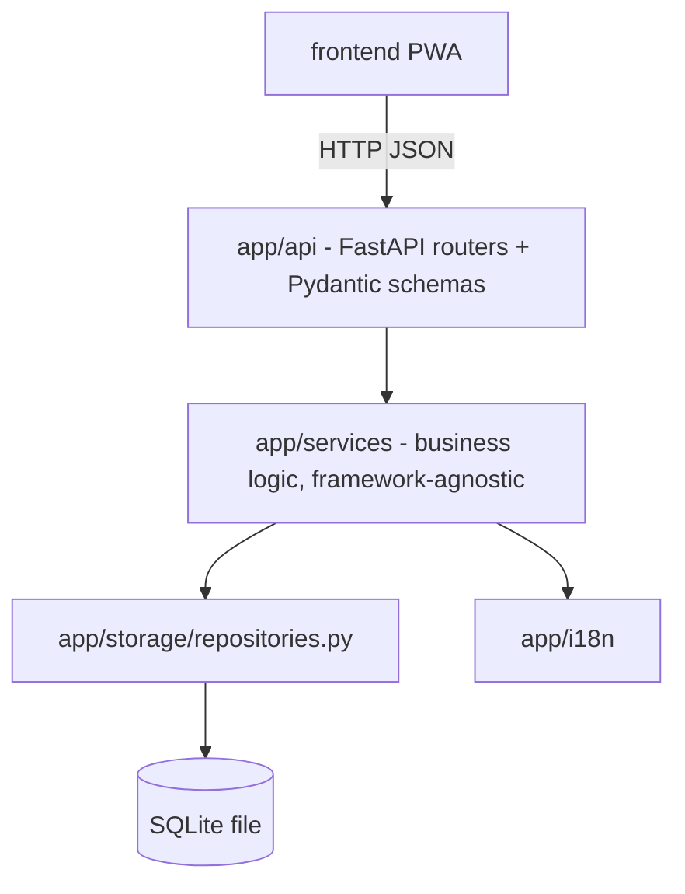

# Architecture

## Why this stack

**Backend: Python, FastAPI, SQLite via the standard library `sqlite3` (no ORM).**
Python makes CSV parsing, date/number locale handling, and image hashing
straightforward with little code. FastAPI gives automatic request
validation and interactive API docs (`/docs`) for free, which doubles as
living API documentation. SQLite is a single file, needs no separate server
process, and is more than enough for a personal or family cellar (hundreds
to low thousands of bottles); the repository layer (`app/storage/repositories.py`)
is the only place that knows SQL, so swapping in PostgreSQL + SQLAlchemy
later - if this ever needs to serve many concurrent households - only
touches that one module.

**Frontend: dependency-free JavaScript (no framework, no build step), as an
installable PWA.** No React/Vue/build pipeline: the app is a handful of ES
modules loaded directly by the browser. This keeps the "simple graphical
interface" requirement genuinely simple, avoids a Node build toolchain the
person hosting this might not want to maintain, and means there is nothing
to compile before deploying - copy the `frontend/` folder anywhere static
files can be served. A service worker + IndexedDB provide the offline
capability.

**Why not SQLAlchemy / a JS framework at all costs?** Both would be
reasonable choices too. This project optimizes for: (a) the smallest
dependency footprint that still does the job well, since it is meant to be
self-hosted by one person or family, and (b) every layer being testable in
isolation. If your priorities differ (e.g. you want a richer UI and don't
mind a build step), `app/storage/repositories.py` and the `frontend/js/`
modules are the two places to swap out.

## Layers (backend)



* **`app/core`** - plain dataclasses (`Wine`, `Cellar`, `Holding`, `Movement`,
  `User`) and exceptions. No framework imports here at all.
* **`app/storage`** - `schema.sql` plus `repositories.py`: every SQL
  statement in the whole project lives in this one file, behind plain
  functions like `insert_wine`, `cellar_fill`, `update_holding`.
* **`app/services`** - the actual business logic (CSV import/export,
  statistics, the move-plan advisor, recommendations, auth, enrichment,
  photo recognition). These depend only on `app/core` and `app/storage`,
  never on FastAPI - which is what let most of this project's tests run
  with zero third-party installs (see `docs/testing.md`).
* **`app/api`** - thin FastAPI routers that parse a request, call one
  service function, and shape the response. Deliberately kept dumb.

This is a small "clean architecture" / hexagonal split: business rules
don't know they're being served over HTTP, which is what makes them easy to
test and would make it easy to add, say, a CLI or a scheduled job later
without duplicating logic.

## Data integrity & offline sync (requirement 8)

Every mutable row (`wines`, `cellars`, `holdings`) carries a `version`
integer. Updates are written as
`UPDATE ... SET version = version + 1 WHERE id = ? AND version = ?`
(optimistic concurrency): if another change landed first, the `WHERE` clause
matches zero rows and the caller gets a `ConflictError` instead of silently
clobbering someone else's edit.

Every add/move/remove/import/enrich action also appends one row to
`movements` (the journal, requirement 4), tagged with an optional
client-generated `client_op_id`. The frontend's offline queue
(`frontend/js/offlineQueue.js` + `db.js`) stores actions performed while
offline in IndexedDB, each with such an id, and replays them in order once
back online (`api.js: syncOutbox()`); the backend's
`client_op_id UNIQUE` constraint makes replaying (or retrying after a
flaky connection) safe - a repeated id is a no-op, not a duplicate bottle.

## Frontend structure

```
frontend/
  index.html          single-page shell
  manifest.json         PWA metadata (installable on phone/desktop)
  service-worker.js     caches the app shell for offline load
  css/styles.css        one stylesheet, no preprocessor
  js/
    app.js               bootstrap: auth check, nav, router, sync
    api.js               fetch wrapper + offline queueing
    db.js                IndexedDB wrapper (cache + outbox)
    offlineQueue.js       pure queue logic (unit tested under Node)
    i18n.js               dictionary loading + interpolation
    router.js             minimal hash router
    charts.js             hand-rolled SVG bar/donut charts
    dom.js                safe element-creation helpers
    pages/*.js            one module per screen
```

Nothing here needs `npm install` to run in a browser. `frontend/package.json`
exists purely so Node recognizes these as ES modules when running
`node --test frontend/tests/logic.test.js`; it declares zero dependencies.

## Enrichment & recognition: what's real vs. a documented extension point

See `docs/roadmap.md` for the honest breakdown - in short, the *merge
logic* (comparing a freshly fetched value's confidence against what's
already on file, and never silently overwriting a manually entered value)
is fully implemented and tested; the actual internet-connected data source
is a `MockEnrichmentProvider` you're expected to replace, because which
real service to call is a licensing/ToS decision for you to make, not a
default this codebase should bake in.

## Tooling and reproducibility

`pyproject.toml` is the project manifest for runtime dependencies, development dependencies, pytest, coverage, and Ruff. `uv.lock` resolves the complete cross-platform dependency graph and is committed. Development uses `uv sync --frozen --group dev`; Docker uses `uv sync --frozen --no-dev`; CI uses the same lock file on every supported Python version. The `backend/requirements*.txt` files are generated compatibility exports only.

Ruff is the single Python formatter, import sorter, and linter. Node remains necessary only for syntax checking and the dependency-free frontend test runner; there is still no frontend build step. `pre-commit` provides local commit/push hooks, but GitHub's protected `CI Gate` is the authoritative architecture-quality boundary.

The CI workflow deliberately exposes one stable aggregate job name. This lets the internal test matrix evolve without repeatedly changing branch protection. See `docs/development.md` and `docs/github-protection.md`.
