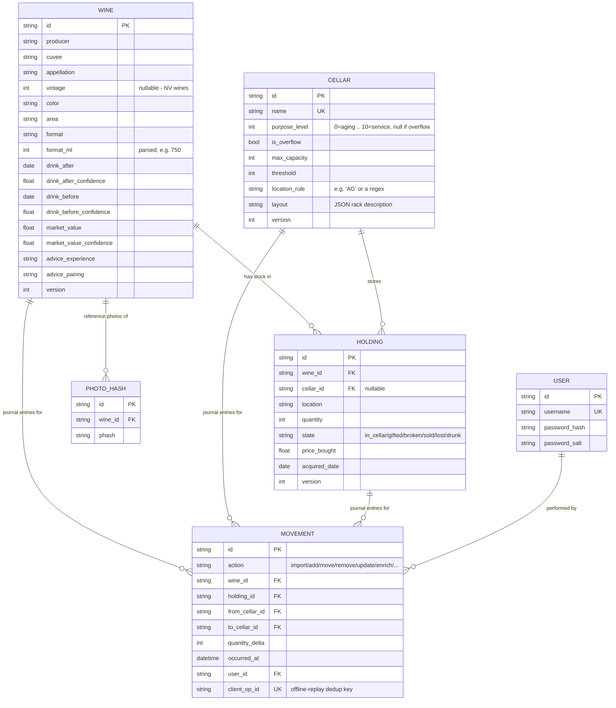

# Data model

## Entity-relationship overview

## Why Wine and Holding are separate

A CSV row describes one purchase/lot: a wine's identity (producer, cuvee,
appellation, vintage, color, area, format) plus where/how many/at what
price. But the same wine can end up split across cellars (a case in the
aging cellar, one bottle moved to the kitchen fridge), and re-importing the
same CSV shouldn't create duplicate catalog entries. So:

* **`Wine`** = the catalog identity + tasting metadata (drink window, market
  value, serving/pairing advice). Deduplicated on
  `(producer, cuvee, appellation, vintage, format)`, case-insensitively.
* **`Holding`** = "N bottles of this Wine, in this Cellar/location, in this
  state". Add/move/remove operate on Holdings; a partial move or removal
  splits a Holding into two rather than mutating quantities in place, so
  the removed/moved portion keeps its own state and location history.

## CSV field mapping (requirements 1 & 2)

Mandatory columns (must exist; individual cells may be blank where that's
legitimate, e.g. no vintage for a non-vintage Champagne):

| Field | English header | French header |
|---|---|---|
| producer | Producer | Producteur |
| cuvee | Cuvee / Cuvée | Cuvée |
| appellation | Appellation | Appellation |
| vintage | Vintage | Millésime |
| color | Color | Couleur |
| area | Area / Region | Région |
| format | Format | Format |

Optional columns:

| Field | English header | French header |
|---|---|---|
| price_bought | Price bought | Prix d'achat |
| quantity | Quantity / Number of Bottles | Quantité |
| drink_before | Drink before / Best before | À boire avant |
| drink_after | Drink after | À boire après |
| cellar | Cellar | Cave |
| location | Location | Emplacement |
| state | State | État |
| advice_experience | Serving advice | Conseil de dégustation |
| advice_pairing | Dish pairing | Accord mets-vin |
| market_value | Market value | Valeur estimée |

Headers are matched case- and accent-insensitively, so a mix of English and
French column names in the same file works. The importer also auto-detects:
comma vs. semicolon delimiters, UTF-8 vs. Windows-1252 encoding, and
comma-as-decimal-separator numbers (all common with French-locale Excel
exports) - see `app/services/csv_io.py` and its unit tests for the exact
rules, including the "bare year" convention (`drink_after: 2028` means
Jan 1 2028; `drink_before: 2028` means Dec 31 2028).

## Cellar purpose scale (requirement 3 + the aging/service note)

`purpose_level` is an integer 0-10: 0 is pure aging, 10 is pure service,
values in between are a deliberate mix. `is_overflow` is a separate flag,
not a point on that scale - overflow cellars are for "extra space, outside
the real cellars" (e.g. a case sitting in a garage) and are treated by the
move-plan advisor as a place bottles should move *out of* into a real
cellar whenever room allows, regardless of the bottle's own readiness.
