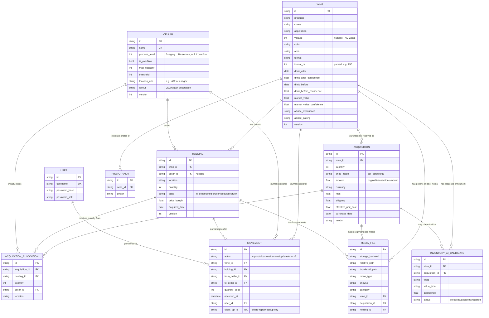

# Data model

## Entity-relationship overview

## Why Wine and Holding are separate

An inventory operation combines several facts: the wine identity, the original
acquisition transaction, and the current storage allocation. The same wine can
be bought repeatedly at different prices and split across cellars, so those
facts must not be collapsed into one catalog row. Therefore:

* **`Wine`** = the catalog identity + tasting metadata (drink window, market
  value, serving/pairing advice). Deduplicated on
  `(producer, cuvee, appellation, vintage, format)`, case-insensitively.
* **`Acquisition`** = the original transaction: quantity, per-bottle or total
  amount, currency, fees, shipping, purchase date, vendor and provenance. The
  original amount is preserved while `effective_unit_cost` supports summaries.
* **`Holding`** = "N bottles of this Wine, in this Cellar/location, in this
  state". Add/move/remove operate on Holdings; a partial move or removal
  splits a Holding into two rather than mutating quantities in place, so
  the removed/moved portion keeps its own state and location history.
* **`AcquisitionAllocation`** = how much of an Acquisition was initially
  assigned to a Holding/location. It lets one wine and even one purchase be
  represented without duplicating identity data.

Correcting an identity field updates the shared Wine and therefore every
holding of it. Correcting price or purchase date updates only the selected
Acquisition; the Holding's effective per-bottle cost/date is recomputed for
compatibility. Legacy stock without an Acquisition keeps its direct Holding
price/date. Every correction is optimistic-versioned, journaled, and enclosed
in one database transaction. Before and after mutation the backend checks
SQLite structure, foreign keys and core domain invariants; a failed check rolls
the operation back. See `docs/editing-bottles.md`.

## CSV field mapping (requirements 1 & 2)

Mandatory columns (must exist; individual cells may be blank where that's
legitimate, e.g. no vintage for a non-vintage Champagne):

| Field | English header | French header |
|---|---|---|
| producer | Producer | Producteur |
| cuvee | Cuvee / Cuvée | Cuvée |
| appellation | Appellation | Appellation |
| vintage | Vintage | Millésime |
| color | Color | Couleur |
| area | Area / Region | Région |
| format | Format | Format |

Optional columns:

| Field | English header | French header |
|---|---|---|
| price_bought | Price bought | Prix d'achat |
| quantity | Quantity / Number of Bottles | Quantité |
| drink_before | Drink before / Best before | À boire avant |
| drink_after | Drink after | À boire après |
| cellar | Cellar | Cave |
| location | Location | Emplacement |
| state | State | État |
| advice_experience | Serving advice | Conseil de dégustation |
| advice_pairing | Dish pairing | Accord mets-vin |
| market_value | Market value | Valeur estimée |

Headers are matched case- and accent-insensitively, so a mix of English and
French column names in the same file works. The importer also auto-detects:
comma vs. semicolon delimiters, UTF-8 vs. Windows-1252 encoding, and
comma-as-decimal-separator numbers (all common with French-locale Excel
exports) - see `app/services/csv_io.py` and its unit tests for the exact
rules, including the "bare year" convention (`drink_after: 2028` means
Jan 1 2028; `drink_before: 2028` means Dec 31 2028).

## Cellar purpose scale (requirement 3 + the aging/service note)

`purpose_level` is an integer 0-10: 0 is pure aging, 10 is pure service,
values in between are a deliberate mix. `is_overflow` is a separate flag,
not a point on that scale - overflow cellars are for "extra space, outside
the real cellars" (e.g. a case sitting in a garage) and are treated by the
move-plan advisor as a place bottles should move *out of* into a real
cellar whenever room allows, regardless of the bottle's own readiness.

## Inventory media and proposed enrichment

The unified Add inventory workflow stores media files outside SQLite under the
configured media directory. `media_files` keeps relative paths, MIME type,
original filename, dimensions, category, SHA-256 hash, thumbnail path and the
appropriate Wine/Acquisition/Holding relationship. Backups must therefore
include both the SQLite database and the media directory.

AI-assisted identity and enrichment are never committed as unquestioned owner
facts. `inventory_ai_candidates` records editable proposed values, confidence,
rationale/evidence and review status. Quantity, purchase facts, storage,
condition and provenance remain user-confirmed data.

## Internet enrichment records

Research is append-only evidence plus reviewed candidates, not an opaque update:

- `enrichment_jobs` records provider, topics, status, usage and errors;
- `enrichment_sources` stores URLs, domains, reliability and identity match;
- `enrichment_candidates` stores normalized values, confidence and decisions;
- `market_observations` stores each offer before aggregation;
- `wine_enrichment_profiles` stores accepted rich topics;
- `wine_external_identifiers` stores identifiers such as LWIN.

The ordinary `wines` fields remain the compatibility surface for accepted
drinking windows, replacement value, pairing and serving advice.

<!-- sweetness-preservation -->
## Colour and sweetness

Colour and sweetness are stored separately. CSV values such as `blanc moelleux`, `rouge liquoreux`, `sweet white`, and `sweet red` keep the base colour (`white` or `red`) and also populate the extended wine-identity sweetness field. A dedicated `Sweetness` / `Sucrosité` CSV column is supported and takes precedence over sweetness inferred from the colour cell. Sweetness can be corrected later from **Edit bottle**, and the update preserves all other identity details.

